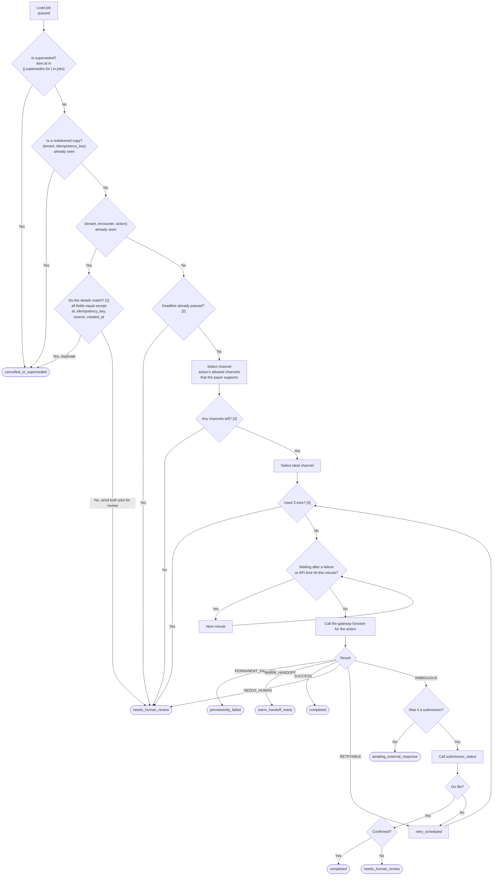

# State machine

How one job moves through the engine.

## Examples from the run

| Job | Action | Payer | Channel | Result | Ends as |
|---|---|---|---|---|---|
| WI_0001 | status check | Medicare | api | SUCCESS | `completed` |
| WI_0004 | corrected claim | Aetna | clearinghouse | AMBIGUOUS, then on file | `completed` |
| WI_0031 | appeal | BCBS | portal | RETRYABLE, then SUCCESS | `completed` |
| WI_0050 | phone call | Cigna | ivr | WARM_HANDOFF | `warm_handoff_ready` |
| WI_0021 | status check | BCBS | portal | NEEDS_HUMAN | `needs_human_review` |

## States

| State | Meaning |
|---|---|
| `queued` | Loaded, not worked yet |
| `retry_scheduled` | Failed, will try again after a wait |
| `awaiting_external_response` | Payer hasn't decided yet |
| `in_progress` | Not used. Calls finish immediately |
| `completed` | Done |
| `needs_human_review` | A person has to take it |
| `warm_handoff_ready` | A rep is on the phone for a person |
| `permanently_failed` | Payer rejected it |
| `cancelled_or_superseded` | Copy or replaced, never worked |

Rounded boxes are where a job stops.

[1] `source` is ignored. When an ML-engine job and a manually entered job disagree, both go to a human instead of the engine picking one.

[2] A past-due submission or appeal is flagged as money that may not be recoverable. A past-due status check or other action is flagged as an internal deadline.

[3] No usable channel means upstream asked for an action this payer can't receive. In production this would be its own state that goes back to upstream. The schema only allows 9 states, so it uses `needs_human_review` with that reason.

[4] 3 tries then a person is a simplification. In real life the next step depends on why it failed:

- Too many calls: wait, and don't count it as a try.
- Login expired: log in again and retry the same channel.
- Channel broken, like a changed portal page or a failed phone login: try the next channel.
- No rep after hours: retry during the payer's business hours.
- Payer says pending: check back in days, not minutes.
- Deadline far away: wait longer between tries. Deadline close: hand off sooner.

Before switching channels on a submission, confirm the first attempt didn't land, or it could be filed twice. Only hand off after every usable channel fails, and list what was tried on each one.
